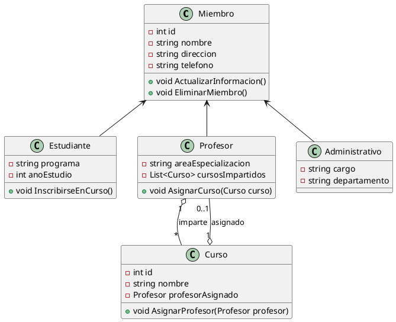
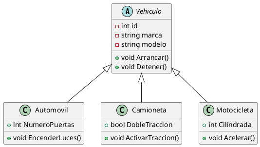
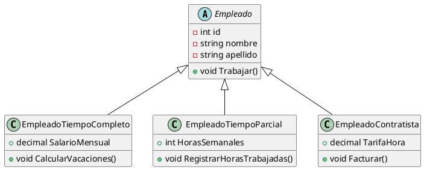
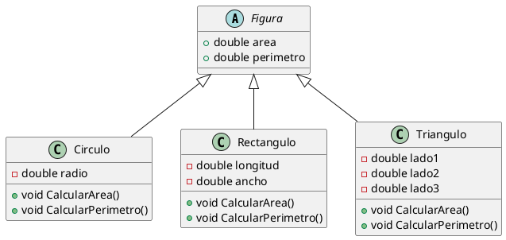
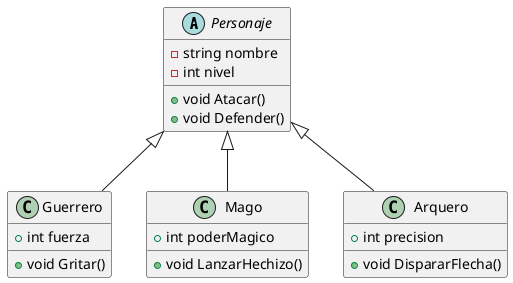
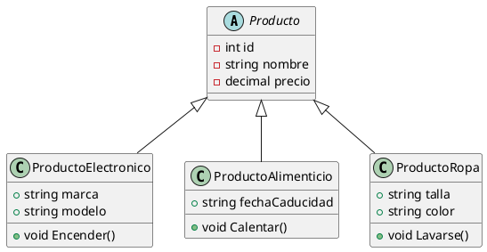
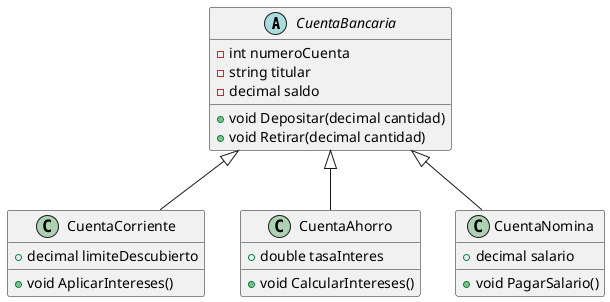

# Ejemplos de POO

Programación orientada a objetos con herencias múltiples, asociación bidireccional, 

Se requiere desarrollar un sistema de gestión para una universidad. La universidad tiene diferentes tipos de miembros: estudiantes, profesores y personal administrativo. Cada miembro tiene su información personal, como nombre, dirección y número de teléfono. Además, los estudiantes tienen información específica, como el programa en el que están inscritos y su año de estudio. Los profesores tienen información sobre los cursos que imparten y su área de especialización. El personal administrativo tiene información sobre su cargo y departamento.

El sistema debe permitir la gestión de todos los miembros de la universidad, incluyendo la creación, actualización y eliminación de información. También debe ser capaz de asignar profesores a cursos y gestionar la inscripción de estudiantes en programas académicos.

Un "banco" tiene varios "clientes" con "cuentas" que puede ser de dos tipos "cuenta corriente" o "cuenta guardada". Las cuentas llevan un registro de "transacciones de las ATM".
El banco cuenta con cajeros automáticos, y cada usuario puede acceder a los cajeros con su tarjeta bancaria y verificando la contraseña.
![[UML-class-diagram-ATM-sys.png]]

---

1. **Sistema de gestión de vehículos:**
   "Diseña un sistema de gestión de vehículos que incluya clases base como `Vehiculo` y subclases para diferentes tipos de vehículos (por ejemplo, `Automovil`, `Camioneta`, `Motocicleta`). Implementa métodos y propiedades comunes a todos los vehículos en la clase base y características específicas de cada tipo de vehículo en las subclases."

2. **Sistema de gestión de empleados:**
   "Desarrolla un sistema de gestión de empleados que incluya una clase base `Empleado` y subclases para diferentes categorías de empleados (por ejemplo, `EmpleadoTiempoCompleto`, `EmpleadoTiempoParcial`, `EmpleadoContratista`). Utiliza la herencia para compartir comportamientos comunes entre las diferentes categorías de empleados y para especializar comportamientos específicos."

3. **Sistema de gestión de figuras geométricas:**
   "Crea un sistema de gestión de figuras geométricas que incluya una clase base `Figura` y subclases para diferentes tipos de figuras (por ejemplo, `Circulo`, `Rectangulo`, `Triangulo`). Implementa métodos para calcular el área, el perímetro y otras propiedades comunes a todas las figuras en la clase base, y métodos especializados en las subclases."

4. **Juego de rol con personajes:**
   "Diseña un juego de rol que incluya clases base como `Personaje` y subclases para diferentes tipos de personajes (por ejemplo, `Guerrero`, `Mago`, `Arquero`). Utiliza la herencia para compartir atributos y habilidades comunes entre los personajes, y para definir comportamientos específicos para cada tipo."

5. **Sistema de gestión de productos en una tienda:**
   "Escribe un sistema de gestión de productos para una tienda que incluya una clase base `Producto` y subclases para diferentes categorías de productos (por ejemplo, `ProductoElectronico`, `ProductoAlimenticio`, `ProductoRopa`). Utiliza la herencia para modelar las relaciones entre los diferentes tipos de productos y sus propiedades específicas."

6. **Sistema de gestión de cuentas bancarias:**
   "Desarrolla un sistema de gestión de cuentas bancarias que incluya una clase base `CuentaBancaria` y subclases para diferentes tipos de cuentas (por ejemplo, `CuentaCorriente`, `CuentaAhorro`, `CuentaNomina`). Implementa métodos para realizar operaciones comunes como depósitos, retiros y consultas de saldo en la clase base, y métodos especializados en las subclases."

