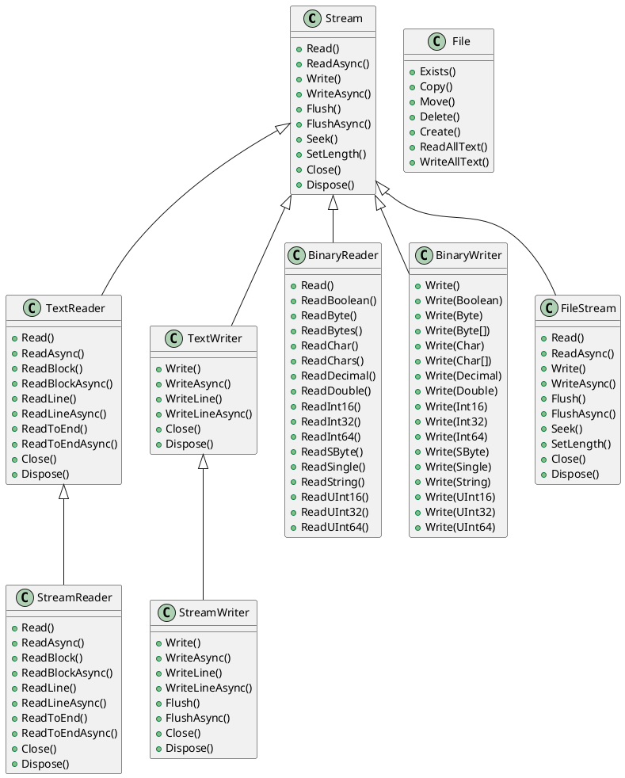

```plantuml
@startuml

class Stream {
    +Read()
    +ReadAsync()
    +Write()
    +WriteAsync()
    +Flush()
    +FlushAsync()
    +Seek()
    +SetLength()
    +Close()
    +Dispose()
}

class TextReader {
    +Read()
    +ReadAsync()
    +ReadBlock()
    +ReadBlockAsync()
    +ReadLine()
    +ReadLineAsync()
    +ReadToEnd()
    +ReadToEndAsync()
    +Close()
    +Dispose()
}

class TextWriter {
    +Write()
    +WriteAsync()
    +WriteLine()
    +WriteLineAsync()
    +Close()
    +Dispose()
}

class BinaryReader {
    +Read()
    +ReadBoolean()
    +ReadByte()
    +ReadBytes()
    +ReadChar()
    +ReadChars()
    +ReadDecimal()
    +ReadDouble()
    +ReadInt16()
    +ReadInt32()
    +ReadInt64()
    +ReadSByte()
    +ReadSingle()
    +ReadString()
    +ReadUInt16()
    +ReadUInt32()
    +ReadUInt64()
}

class BinaryWriter {
    +Write()
    +Write(Boolean)
    +Write(Byte)
    +Write(Byte[])
    +Write(Char)
    +Write(Char[])
    +Write(Decimal)
    +Write(Double)
    +Write(Int16)
    +Write(Int32)
    +Write(Int64)
    +Write(SByte)
    +Write(Single)
    +Write(String)
    +Write(UInt16)
    +Write(UInt32)
    +Write(UInt64)
}

class FileStream {
    +Read()
    +ReadAsync()
    +Write()
    +WriteAsync()
    +Flush()
    +FlushAsync()
    +Seek()
    +SetLength()
    +Close()
    +Dispose()
}

class StreamReader {
    +Read()
    +ReadAsync()
    +ReadBlock()
    +ReadBlockAsync()
    +ReadLine()
    +ReadLineAsync()
    +ReadToEnd()
    +ReadToEndAsync()
    +Close()
    +Dispose()
}

class StreamWriter {
    +Write()
    +WriteAsync()
    +WriteLine()
    +WriteLineAsync()
    +Flush()
    +FlushAsync()
    +Close()
    +Dispose()
}

class File {
    +Exists()
    +Copy()
    +Move()
    +Delete()
    +Create()
    +ReadAllText()
    +WriteAllText()
}

Stream <|-- FileStream
Stream <|-- TextReader
Stream <|-- TextWriter
Stream <|-- BinaryReader
Stream <|-- BinaryWriter

TextReader <|-- StreamReader
TextWriter <|-- StreamWriter

@enduml
```
