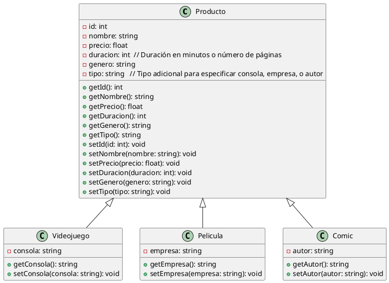
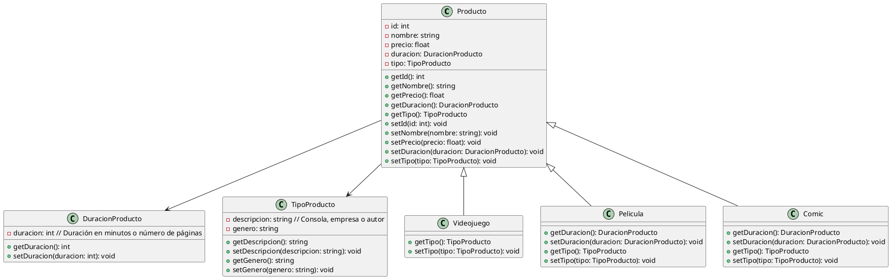

# Diagrama UML
## Ejercicio 3 (tienda digital)

Heredar = recibir
Donar = dar

- Diagrama simple, 3 clases que heredan de 1 clase base o 1 clase base que sirve como superclase para 3 clases derivadas

---

- Diagrama algo más complejo: 1 clase base, 3 clases derivadas, 2 clases adicionales relacionadas por composición

